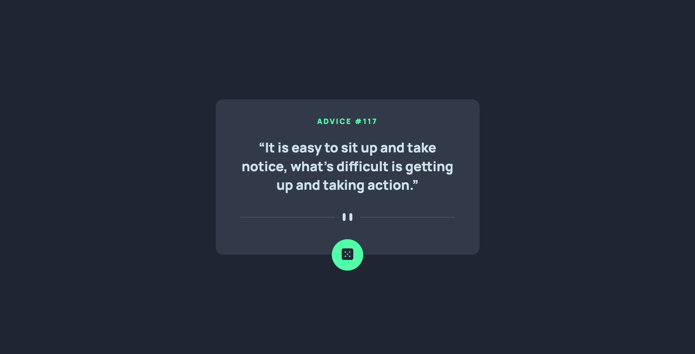

# Frontend Mentor - Advice generator app solution

This is a solution to the [Advice generator app challenge on Frontend Mentor](https://www.frontendmentor.io/challenges/advice-generator-app-QdUG-13db). Frontend Mentor challenges help you improve your coding skills by building realistic projects.

## Table of contents

- [Overview](#overview)
  - [The challenge](#the-challenge)
  - [Screenshot](#screenshot)
  - [Links](#links)
- [My process](#my-process)
  - [Built with](#built-with)
  - [What I learned](#what-i-learned)
  - [Continued development](#continued-development)
  - [Useful resources](#useful-resources)
- [Acknowledgments](#acknowledgments)

## Overview

### The challenge

Users should be able to:

- View the optimal layout for the app depending on their device's screen size
- See hover states for all interactive elements on the page
- Generate a new piece of advice by clicking the dice icon

### Screenshot



### Links

- Live Site URL: [Add live site URL here](https://your-live-site-url.com)

## My process

### Built with

- Semantic HTML5 markup
- CSS custom properties
- Flexbox
- CSS Grid
- Mobile-first workflow

### What I learned

1. The &lt;blockquote&gt; element

```html
<blockquote>
  <p>" Advice text here "</p>
</blockquote>
```

2. The &lt;picture&gt; element and the &lt;source&gt; element with srcset and media attributes.

```html
<picture>
  <source
    srcset="./images/pattern-divider-desktop.svg"
    media="(min-width: 1000px)"
  />
  
</picture>
```

3. Vertically and horizontally centering with CSS grid.

```css
body {
  display: grid;
  place-items: center;
  min-height: 100vh;
}
.card {
  width: 50vw;
  height: 50vh;
}
```

4. AJAX - Asynchronous JavaScript and XML(/JSON)

```js
async function fetchData() {          // 1
  try {                               // 4
    const res = await fetch("/url");  // 2
    const data = await res.json();    // 3
    return data;
  } catch (err) {
    adviceId.textContent = `Advice #`;
    quote.textContent = `Whoops, error occurred... Refresh the page👍`;
  }
};
```

- Summary:
  1. The keywords - async and await - 
      - The async keyword is used to define the async function that allows to take the await keyword within it.
      - more information [MDNWebDocs](https://developer.mozilla.org/en-US/docs/Web/JavaScript/Reference/Statements/async_function)
  2. The fetch() method starts the process of fetching a resource from 
     the network. With the await keyword, the async function to pause its execution until a Promise (fetching process) is settled.
     - more information [MDNWebDocs](https://developer.mozilla.org/en-US/docs/Web/JavaScript/Reference/Statements/async_function)
  3. The json() method of the response parse the data as a JSON format.
  4. The try...catch statement is an error handling technique here used 
     to tell if data is fetched successfully. If failed or "rejected", code inside the catch-block will be executed (e.g. error messages).

### Continued development

1. AJAX - Asynchronous JavaScript and XML(/JSON)
2. CSS animation

## Useful resources

- [MDN Web Docs](https://developer.mozilla.org/en-US/) - A good reference for HTML tags and AJAX used for this challenge.

## Acknowledgments

Many thanks to the programmers below for concise solutions:

- [Tagvi-s-frontend-mentor-challenges](https://github.com/Tagvi-s-frontend-mentor-challenges/advice-generator-app-main) - Structuring HTML tags including &lt;blockquote&gt;, &lt;picture&gt;, and &lt;source&gt; elements.
- [Ohiosveryown](https://gist.github.com/ohiosveryown/deac5188b536a7fb6537cfaf3e941293) - Certering an item with CSS grid
